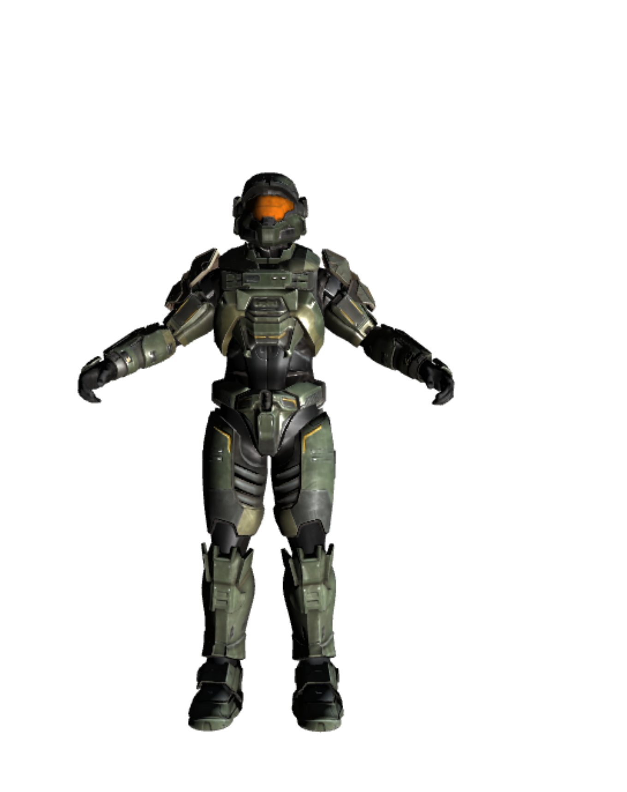

# try_WebGL
three.js

# run
1. npm run dev
2. build
    * npm run build
    * npm run preview

# current status
1. add skybox
  

# issue
- [ ] blender 导出GLB 文件可以正常加载，但GLB文件太大了

- [ ] fbx文件无法正常加载纹理

- [ ] 手动指定纹理后，左半部分纹理贴图显示不正确

